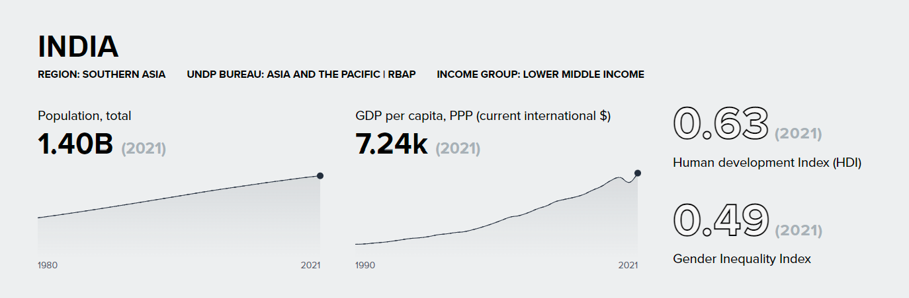
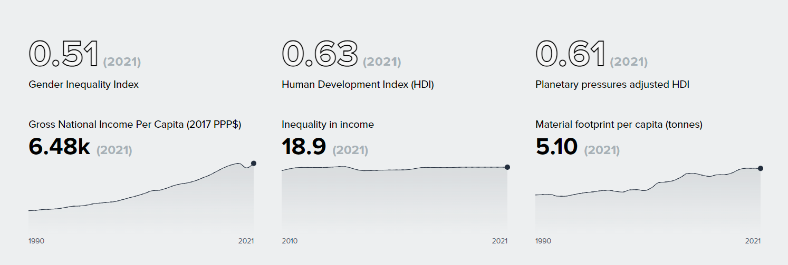
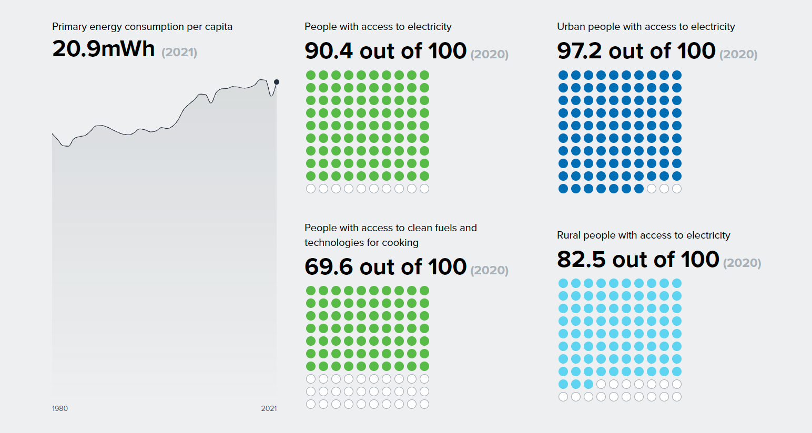

# Time Series Visualization on the Top of Different Pages
#### This project is for the top line visualization on the different pages (region pages, country pages and signature solution pages) of Data Futures Platform.

## Table of Contents
* [Link for the visualization](#section-01)
* [Steps to integrate the vis in static page](#section-02)
    * [Steps to integrate Country Viz](#section-02-01)
    * [Steps to integrate Regional Viz](#section-02-02)
    * [Steps to integrate Signature Solution Viz](#section-02-03)
* [Pages on DFP where This Viz is Used](#section-03)
* [Related Repos](#section-04)
* [Global CSS Files and Repo](#section-05)
* [Build With](#section-06)
* [Installation](#section-07)
* [Local Deployment](#section-08)
* [Available Scripts](#section-09)
* [Tooling Setup](#section-10)
* [Contact](#section-11)

## Link for the visualization<a name="section-01"></a>
[https://undp-ss-viz.netlify.app/](https://undp-ss-viz.netlify.app/)

## Steps to Integrating the Visualization in the Data Future Platform or Any Other Page<a name="section-02"></a>
_Only editor and admins of Data Futures Platform are allowed to edit pages and embed the visualization in any page._

### Country Visualization<a name="section-02-01"></a>



Country visualization will be rendered within the following div on a static page:
```
<div data-bucket-country-top-graphs-embed class="country~<Use Country Alpha-3 Code Here>"></div>
```

__If the class is not mentioned then the code uses the last 3 character of the URL as the country code__

___

### Regional Visualization<a name="section-02-02"></a>



Regional visualization will be rendered within the following div on a static page:
```
<div data-bucket-region-top-graphs-embed class="region~<Use Region Code Here>"></div>
```

Available values of region code in the class element:
* AS (for Arab States)
* EAP (for East Asia and Pacific)
* ECA (for Europe and Central Asia)
* LAC (for Latin America and the Caribbean)
* SA (for South Asia)
* SSA (for Sub Saharan Africa)
___

### Signature Solution Visualization<a name="section-02-03"></a>



Signature Solution visualization will be rendered within the following div on a static page:
```
<div data-bucket-top-graphs-embed class="signatureSolution~<Use Signature Solutions Here>"></div>
```

Available values for Signature solutions in the class element (Note: _Replace ` ` with a `+`_):
* Poverty+and+Inequality
* Environment
* Gender
* Energy
* Resilience
* Governance

___

Apart from the mentioned `div` above the following `script` and `link` needs to be added to the `head` or in the embed code
```
<script defer src="<Link to the Visualization Mentioned Above>/static/js/main.js"></script>
<link rel="stylesheet" href="https://undp-data.github.io/stylesheets-for-viz/style/mainStyleSheet.css" />
<link rel="stylesheet" href="https://undp-data.github.io/stylesheets-for-viz/style/StyleForGraphingInterface.css" />
<link rel="stylesheet" href="https://undp-data.github.io/stylesheets-for-viz/style/StyleForGraph.css" />
```

## Pages Where the Visualization is Used<a name="section-03"></a>
The visualization are the top line visualization on the gray background on the following pages
* [Signature Solution - Poverty and Inequality](https://data.undp.com/topics/poverty-and-inequality)
* [Signature Solution - Resilience](https://data.undp.com/topics/resilience)
* [Signature Solution - Governance](https://data.undp.com/topics/governance)
* [Signature Solution - Energy](https://data.undp.com/topics/energy)
* [Signature Solution - Environment](https://data.undp.com/topics/environment)
* [Signature Solution - Gender Equality](https://data.undp.com/topics/gender-equality)
* This is also used in the Country pages in DFP. For ex. [here](https://data.undp.acsitefactory.com/countries/AFG)
* This is also used in the Regional pages in DFP. For ex. [here](https://data.undp.acsitefactory.com/countries/AFG)

## Related Repos<a name="section-04"></a>
* [__Indicators-MetaData__](https://github.com/UNDP-Data/Indicators-MetaData): This is the metadata sheet for indicators used in the visualization
* [__country-taxonomy-from-azure__](https://github.com/UNDP-Data/country-taxonomy-from-azure): This is data sheet with meta data for Countries
* [__Access-All-Data-Data-Repo__](https://github.com/UNDP-Data/Access-All-Data-Data-Repo): This is the data sheet for visualization
* [__stylesheet-for-viz__](https://github.com/UNDP-Data/stylesheets-for-viz): Repo which defines the css settings for the project

## Global CSS for UI and Graphs<a name="section-05"></a>
__Git Repo__: https://github.com/UNDP-Data/stylesheets-for-viz

__Link for stylesheets__
* https://undp-data.github.io/stylesheets-for-viz/style/mainStyleSheet.css
* https://undp-data.github.io/stylesheets-for-viz/style/StyleForGraphingInterface.css
* https://undp-data.github.io/stylesheets-for-viz/style/StyleForGraph.css

## Build with<a name="section-06"></a>
* __React__: Used as MVC framework.
* __styled-components__: Utilizes tagged template literals and the power of CSS, allows to write actual CSS code to style the components in JS/TS.
* __Various D3 Libraries__: Used for visualizations, adding interaction and reading the csv data file.
* __AntD__: For UI elements like dropdown, buttons, checkbox, and slider.
* __lodash__: Used for manipulating and iterating arrays and objects.
* __undp-viz-colors__: This is package for defining the visualization color palette.

## Installation<a name="section-07"></a>
This project uses `npm`. For installation you will need to install `node` and `npm`, if you don't already have it. `node` and `npm` can be installed from [here](https://nodejs.org/en/download/).

To install the project, simply clone the the repo and them run `npm install` in the project folder. You can use terminal on Mac and Command Prompt on Windows.

This project is bootstrapped with [`Vite`](https://vitejs.dev/) and was created using `npm create vite@latest` command.

Run the terminal or command prompt and then run the following

```
git clone https://github.com/UNDP-Data/dv_signature_solutions_aggreated_timeseries.git
cd dv_signature_solutions_aggreated_timeseries
npm install
```

## Local Development<a name="section-08"></a>
To start the project locally, you can run `npm run dev` in the project folder in terminal or command prompt.

This is run the app in development mode. Open [http://localhost:5173/](http://localhost:5173/) to view it in the browser.

The page will reload if you make edits. You will also see any lint errors in the console.

## Available Scripts<a name="section-09"></a>
* `npm run dev`: Executes `vite` and start the local server for local deployment.
* `npm run build`: Executes `tsc && vite build` and builds the app for production and deployment.

## Tooling Setup<a name="section-10"></a>
This project uses ESLint integrated with prettier, which verifies and formats your code so you don't have to do it manually. You should have your editor set up to display lint errors and automatically fix those which it is possible to fix. See [http://eslint.org/docs/user-guide/integrations](http://eslint.org/docs/user-guide/integrations).

This project is build in Visual Studio Code, therefore the project is already set up to work with. Install it from [here](https://code.visualstudio.com/) and then install this [eslint plugin](https://marketplace.visualstudio.com/items?itemName=dbaeumer.vscode-eslint) and you should be good to go.

## Contact<a name="section-11"></a>
[**Mustafa Saifee**](mailto:mustafa.saifee@undp.org)